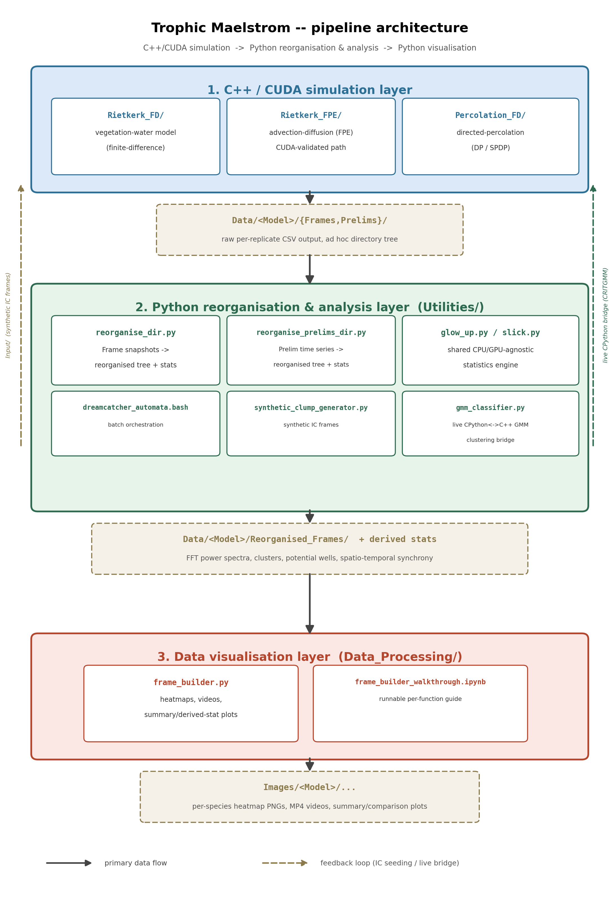

<div align="center">

# Trophic Maelstrom 
## A High Performance Simulation and Data-Analysis Pipeline For Desertification Transitions. ⚡⚡

[](https://isocpp.org/std/status/)
[](https://www.python.org/)
[](https://isocpp.org/std/status/)
[]()
[]()
[]()
</div>

A scientific HPC SPDE (Stochastic Partial Differential Equation) codebase for spatial ecological simulations: the Rietkerk vegetation-water dryland model (extended to a 3-species vegetation-grazer-predator trophic chain) and directed-percolation
(DP) model (implemented as the Reggeon Field Theoretic Equation, similarly extended to 1/2/3 species trophic chains) as used as simpler analogues for studying critical phenomena. The codebase spans three layers:
C++/CUDA simulation engines, a Python/Bash layer that collates simulation data, and then reorganises and statistically post-processes their raw output, and a Python visualisation layer that turns the result into heatmaps, videos, and summary plots.

## 📖 Table of Contents

- [Architecture 🎛️](#architecture-)
  - [1. C++ / CUDA simulation layer 🚀](#1-c--cuda-simulation-layer-)
  - [2. Python/Bash reorganisation & analysis layer 📊🧮](#2-pythonbash-reorganisation--analysis-layer-)
  - [3. Data visualisation layer 🖼️📈](#data-visualisation-layer)
- [📦 Installation & Setting Up Dependencies](#-installation--setting-up-dependencies)
  - [C++ / CUDA layer](#c--cuda-layer)
  - [Python/Bash layers (`Utilities/` and `Data_Processing/`)](#pythonbash-layers-utilities-and-data_processing)
- [Repository layout at a glance](#repository-layout-at-a-glance)

## Architecture 🎛️



Data flows top to bottom through three layers, each writing into a predictable directory tree that the next
layer consumes. Two feedback loops run the other way: `Utilities/synthetic_clump_generator.py` seeds
synthetic initial-condition frames back into `Input/` for the C++ layer to read, and
`Utilities/gmm_classifier.py` is called live, in-process, from `Percolation_FD`'s C++ code (under a
`-DCRITGMM` build) via an embedded CPython bridge rather than through a file on disk.

### 1. C++ / CUDA simulation layer 🚀

Three model implementations, each independently compiled (no Makefile -- see each README for the exact
`g++`/`nvcc` invocations and compile-time macros):

- **[`simulations/Rietkerk_FD/`](simulations/Rietkerk_FD/README.md)** -- finite-difference stochastic
  implementation of the Rietkerk vegetation-water model (1/2/3-species trophic chain) (CPU-validated ✅, CUDA accelerated path contains **known bugs** ❌ ).
- **[`simulations/Rietkerk_FPE/`](simulations/Rietkerk_FPE/README.md)** -- Fokker-Planck-equation variant of
  the same model, adding an advection-diffusion step (GPU-validated ✅; CPU-only path is more experimental and may contain unverified bugs ⚠️⚠️).
- **[`simulations/Percolation_FD/`](simulations/Percolation_FD/README.md)** -- multi-species
  scale free model, implemented as the Reggeon Field Theoretic Equation, and belonging to the Directed Percolation (DP) universality class (1/2/3-species trophic chain) (CPU-validated ✅, CUDA accelerated path contains **known bugs** ❌ ).

All three write raw per-replicate CSV output into an ad hoc directory tree under `simulations/Data/`.

### 2. Python/Bash reorganisation & analysis layer 📊🧮

**[`simulations/Utilities/`](simulations/Utilities/README.md)** turns that raw C++ output across different devices (requires rsync) into a predictable, analysis-ready directory structure and computes a battery of spatial/temporal statistics over it, all
CPU/GPU-agnostic ✅ ([`slick.py`](https://github.com/HAL9K000/slick) routes numerics through `cupy` when available, `numpy` otherwise). Functionality
provided:

- **Reorganisation**: copies and renames raw per-replicate CSV files (`reorganise_dir.py` for Frame
  snapshots, `reorganise_prelims_dir.py` for Prelim time series) into a predictable
  `{PREFIX}/L_{g}_a_{a_val}/dP_{dP}/Geq_{Geq}/...` tree, with collision-safe replicate handling.
- **Per-snapshot/per-directory statistics**: replicate mean/std and survival counts, per-cell replicate
  means, 2D spatial FFT power spectra.
- **Spatial pattern analysis**: clustering (KMeans/GMM/threshold), cluster-size and macro cluster
  statistics, KDE-based potential-well/bistability analysis.
- **Spatio-temporal synchrony analysis**: 2D FFT cross-correlation (NCC/ZNCC), mutual information (MI/AMI),
  and bivariate Moran's I between snapshots at different timepoints, plus harmonic-frequency extraction from
  the resulting correlation curves -- GPU-accelerated for large grids.
- **Batch orchestration & remote data collation**: `dreamcatcher_automata.bash`/`prelims_automata.bash` run
  the above reorganisation and post-processing across many parameter combinations unattended, and (via
  `expect_commands.sh`) can first `rsync` raw output in from multiple remote machines/HPC clusters into a
  single host before reorganising it.
- **Synthetic initial conditions**: `synthetic_clump_generator.py` generates synthetic hexagonal-lattice
  seed frames for the C++ simulators.
- **Live C++ bridge**: `gmm_classifier.py`, embedded directly into `Percolation_FD`'s C++ process for
  real-time GMM cluster-statistics computation during a running simulation.

<a id="data-visualisation-layer"></a>
### 3. Data visualisation layer 🖼️📈

**[`simulations/Data_Processing/`](simulations/Data_Processing/README.md)** consumes the reorganised data and
derived statistics from the layer above and renders them. Functionality provided (via `frame_builder.py`):

- **Frame (spatial snapshot) visualisation**: per-species heatmap PNGs and stitched-together videos, in
  several groupings (all replicates combined, one video per replicate, across-`a` at fixed `T`, with a GAMMA
  interaction-field overlay for spreading-test runs).
- **Frame-derived summary plots**: equilibrium state vs. control parameter `a`, FFT power-spectrum heatmaps,
  potential-well/bistability plots, cluster-size distributions and macro cluster-statistic time series.
- **Prelims (time-series) summary plots**: time-series plots with optional power-law/decay fit overlays,
  equilibrium-state summary and violin plots, phase-space trajectory plots, and cross-prefix/parameter
  comparison plots.

A companion Jupyter notebook, `Data_Processing/frame_builder_walkthrough.ipynb`, provides a full runnable,
documented walkthrough of every one of these functions -- see the `Data_Processing/README.md` for details.

## 📦 Installation & Setting Up Dependencies

### C++ / CUDA layer

None of these are vendored — install them yourself and make sure your compiler/linker can find them
(headers on your include path, libraries on your library path; see the include-path note at the end of
this subsection).

**Core (required for every build, CPU or GPU):**

- A `g++` with C++23 support (the scripts use `g++-14`).
- OpenMP (`-fopenmp`) — bundled with a normal GCC install, nothing extra to install.
- [FFTW3](http://www.fftw.org/) — FFT-accelerated interaction-kernel convolution.
- [ExprTk](https://github.com/ArashPartow/exprtk) — header-only, symbolic-expression parsing for frame
  initialization.
- A CUDA Toolkit (`nvcc`) — required only if you actually want a GPU build (`-DBARRACUDA` in
  `Rietkerk_FD`/`Percolation_FD`, the GPU advection-diffusion solve in `Rietkerk_FPE`); every CPU-only build
  in this repo works without it. Called out as its own bullet, rather than folded into "optional" below,
  because the Python-layer setup instructions further down (`pip3-requirements.txt`, `environment.yml`,
  `setup_environment.sh`) all assume a CUDA Toolkit/driver is *already* installed on the system if you want
  GPU acceleration there too — none of them install the toolkit itself, only `cupy` against it. If your
  `nvcc` is paired with a newer `g++` than it officially supports, pin the host compiler explicitly
  (`-ccbin`, or `-DCMAKE_CUDA_HOST_COMPILER=` for `Rietkerk_FD`'s CMake build) rather than relying on
  whatever `gcc` is first on `PATH` — the two can silently disagree on which standard-library headers to
  use otherwise.

**Optional:**

- [Armadillo](http://arma.sourceforge.net/) — linear algebra / GMM-clustering support in `Percolation_FD`
  (`-DARMA`, `-DCRITGMM`); on Debian/Ubuntu, `sudo apt install libarmadillo-dev` is the easiest route.
- A Python 3 interpreter with NumPy development headers — only for `Percolation_FD`'s `-DCRITGMM` embedded
  GMM-classifier bridge.

**⚠️⚠️ Building FFTW3 from source is recommended over your package manager's build**, even where one is available (e.g. Debian/Ubuntu's `libfftw3-dev`, which ships `libfftw3_omp` rather than the `libfftw3_threads` this codebase actually links against — see below). Distro/conda-forge builds are compiled for broad compatibility, generally without the newer SIMD instruction sets; since the gamma-convolution FFT runs every timestep of every replicate, that's a real, recurring cost on top of missing the threading build you actually need, not a one-off:

```bash
./configure --prefix=$HOME/.local --enable-shared --enable-threads
make -j$(nproc)
make install
```

The important flag is **`--enable-threads`, not `--enable-openmp`**. `--enable-threads` builds
`libfftw3_threads` on top of plain POSIX threads (pthreads); `--enable-openmp` instead builds an
OpenMP-parallel FFTW3 that spins up its own OpenMP thread pool for every transform. Every scheduling script
in this repo already parallelises the *outer* simulation loop with OpenMP (one thread per
replicate/rainfall-value combination) — nesting a second, independent OpenMP pool for FFTW3's *inner* FFT
calls inside that oversubscribes the machine and causes real slowdowns from thread contention, not a
speedup. The `-lfftw3_threads -lfftw3` link line already hand-typed throughout `Scheduling Bashes/*.bash`
(and configured in `Rietkerk_FD/CMakeLists.txt`) assumes the pthreads build.

On top of `--enable-threads`, add whichever SIMD flags your CPU actually supports for a further, sometimes
substantial, speedup — e.g. `--enable-sse2 --enable-avx --enable-avx2 --enable-avx512` (check `/proc/cpuinfo`
or `lscpu` for what your machine has; passing a flag your CPU doesn't support will fail the build, not
silently degrade). **Consult the [FFTW3 installation manual](http://www.fftw.org/fftw3_doc/Installation-and-Customization.html)
and pick the combination appropriate to your own architecture** rather than copying the flags above verbatim.

**ExprTk** is header-only — no build step, just place `exprtk.hpp` somewhere on your include path (e.g.
`$HOME/.local/include/`).

**Updating your include/library paths:** once installed to a non-system prefix like `$HOME/.local`
(recommended if you don't have root, and what the example above and every scheduling script assume), make
sure your compiler/linker can actually find things there:

```bash
export CPATH="$HOME/.local/include:$CPATH"
export LIBRARY_PATH="$HOME/.local/lib:$LIBRARY_PATH"
export LD_LIBRARY_PATH="$HOME/.local/lib:$LD_LIBRARY_PATH"   # for shared libs at runtime
```

(`Rietkerk_FD/CMakeLists.txt` additionally searches `$HOME/.local` automatically regardless of these
env vars, via `CMAKE_PREFIX_PATH`/`HINTS` — see that file — but the hand-typed `g++`/`nvcc` invocations in
every `Scheduling Bashes/*.bash` script still rely on `-I`/`-L` flags or the environment above.)

### Python/Bash layers (`Utilities/` and `Data_Processing/`)

Both layers share one dependency set — core numerics/plotting (`numpy`, `pandas`, `scipy`, `scikit-learn`, ...), `Utilities/`-specific spatial-statistics and HPC packages (`esda`, `libpysal`, `dask`, ...), `Data_Processing/`-specific plotting/video packages (`seaborn`, `opencv-python`, ...), and non-Python system tools like `ffmpeg` for the H264 video re-encode step. Optional GPU acceleration (`cupy`) is
CUDA-version-specific and deliberately left unpinned. See the dependency matrix below and each layer's own README
([`Utilities/README.md`](simulations/Utilities/README.md), [`Data_Processing/README.md`](simulations/Data_Processing/README.md)) for the full breakdown of what's required vs. optional and why.

<details><summary><b>Dependency matrix</b> (click to expand)</summary>

| Dependency | Required? | Used by | Notes |
|---|---|---|---|
| Python 3.10+ | ✅ Yes | Both | automation scripts invoke `python3.11` explicitly |
| `numpy` | ✅ Yes | Both | core numerics |
| `pandas` | ✅ Yes | Both | CSV frame/prelim I/O |
| `scipy` | ✅ Yes | Both | FFT, interpolation, stats |
| `regex` | ✅ Yes | Both | filename pattern matching during reorganisation |
| `matplotlib` | ✅ Yes | Both | base plotting backend for every summary plot |
| `scikit-learn` | ✅ Yes | Both | `sklearn.cluster.KMeans`, `sklearn.mixture.GaussianMixture` |
| `scikit-image` | ✅ Yes | Utilities | — |
| `esda` | ✅ Yes | Utilities | spatial statistics — bivariate Moran's I |
| `libpysal` | ✅ Yes | Utilities | spatial weights, used by `esda` |
| `dask[distributed]` | ⚠️✔️ Recommended | Utilities | preferred over `joblib` for concurrent CPU multi-threading over shared GPU devices — negates Python's GIL |
| `joblib` | ⚠️ Fallback | Utilities | CPU parallel-post-processing fallback backend |
| `psutil` | ✅ Yes | Utilities | imported unconditionally by `glow_up.py` |
| `seaborn` | ✅ Yes | Data_Processing | heatmap/summary plotting |
| `opencv-python` (`cv2`) | ✅ Yes | Data_Processing | builds/reads the per-species heatmap videos |
| `powerlaw` | ✅ Yes | Data_Processing | power-law/decay fit overlays in several `analyse_*` functions |
| `adjustText` | ✅ Yes | Data_Processing | label-placement helper for a few plots |
| `cupy` | ✔️ Optional, but recommended | Both | GPU acceleration; CUDA-version-specific, deliberately left unpinned; everything degrades gracefully to NumPy/SciPy on CPU if it isn't importable or `USE_GPU`/`--gpu` isn't set — recommended for grid sizes `L² ≥ 256×256` |
| `ffmpeg` (binary, not pip-installable) | ✔️ Optional, but recommended | Data_Processing | H264 video re-encode step (`subprocess`); skipped automatically (with a warning) if not found or the OS isn't Linux — video generation itself still works either way |
| `p7zip` (`7z`, binary) | ⚪ Optional | Utilities | `dreamcatcher_automata.bash`'s compression step |
| `rsync` (binary) | ⚪ Optional | Utilities | `dreamcatcher_automata.bash`'s remote-device collation step |
| `expect` (binary) | ⚪ Optional | Utilities | drives the `rsync` calls in `expect_commands.sh` |
| `jupyterlab` / `ipykernel` / `nbformat` | ⚪ Optional | Data_Processing | only to run `frame_builder_walkthrough.ipynb` |
| `nbconvert` | ⚪ Optional | Data_Processing | only to execute that notebook headlessly (`jupyter nbconvert --execute`) |

</details>

**pip (venv):**

```bash
./setup_environment.sh                # creates ~/trophic-maelstrom, installs pip3-requirements.txt,
                                       # auto-detects CUDA and installs a matching cupy build if found
```

**conda/mamba** (also pulls in the non-Python tools like `ffmpeg`, `rsync`, `p7zip`, `expect` that pip can't
install — see the `NOT INCLUDED` note at the bottom of `pip3-requirements.txt` if you're on the pip path
instead):

```bash
conda env create -f environment.yml   # or: mamba env create -f environment.yml (faster)
conda activate trophic-maelstrom
```

`environment.yml` deliberately does not pin `cupy` (GPU acceleration, optional for both layers) — install
it afterwards, into the activated env, matching whichever CUDA Toolkit/driver you already have (this, like
the pip path below, assumes that's already installed — see the CUDA Toolkit note in the C++/CUDA
subsection above):

```bash
pip install cupy-cuda12x     # CUDA 12.x
pip install cupy-cuda13x     # CUDA 13.x
```

## Repository layout at a glance

```
simulations/
  Rietkerk_FD/        C++/CUDA -- vegetation-water model
  Rietkerk_FPE/        C++/CUDA -- Fokker-Planck (advection-diffusion) variant
  Percolation_FD/      C++/CUDA -- directed-percolation model
  Utilities/            Python -- reorganisation, statistics, batch orchestration
  Data_Processing/       Python -- visualisation (frame_builder.py + notebook)
  Data/                 raw + reorganised simulation output
  Input/                 synthetic/seed initial-condition frames
Images/                 generated heatmaps, videos, summary plots
```

There is no top-level build system or package manager for the C++/CUDA layer ⚡⚡ (as of yet) -- each layer is built/run independently; see the README linked for each component above for exact commands.
